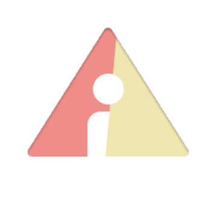
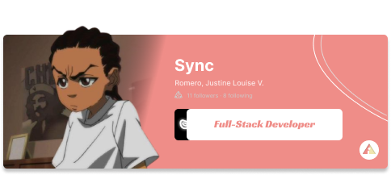
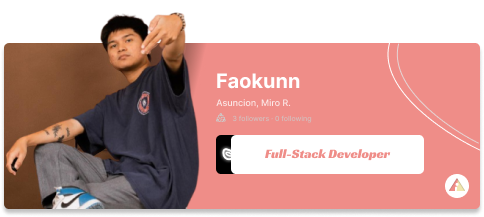
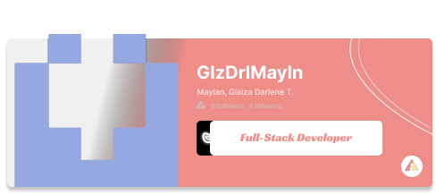

  
  

    Women in the Philippines face safety risks despite legal protections. The SafeZone app helps
    with real-time   tracking, emergency alerts, and safe spaces, empowering quick action in danger.
  

  

   
  <h3 style="font-size: 60px; font-weight: normal; color: grey;">Developers</h3>
    

  <table width="100%" cellspacing="0" cellpadding="0" style="border-collapse: collapse;">
    <tr>
      <td align="center" width="50%">
        
      </td>
      <td align="center" width="50%">
        
      </td>
    </tr>
    <tr>
      <td align="center" width="50%">
        
      </td>
      <td align="center" width="50%">
        
      </td>
    </tr>
  </table>

   
  <h3>Language & Tools</h3>
    

  
  
  
  
  
  

  
<h3>System Methodology</h3>
  
                  

   

<h3>License</h3>
  
<pre>
Copyright © 2015 Javier Tomás
Copyright © 2024 Mihon Open Source Project

Licensed under the Apache License, Version 2.0 (the "License");
you may not use this file except in compliance with the License.
You may obtain a copy of the License at

http://www.apache.org/licenses/LICENSE-2.0

Unless required by applicable law or agreed to in writing, software
distributed under the License is distributed on an "AS IS" BASIS,
WITHOUT WARRANTIES OR CONDITIONS OF ANY KIND, either express or implied.
See the License for the specific language governing permissions and
limitations under the License.
</pre>

