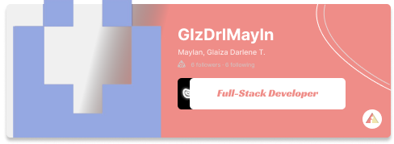

## 🛠️ Technologies Used

### Framework:
- **[Flutter](https://flutter.dev/)**: A powerful open-source UI toolkit for building natively compiled mobile, web, and desktop applications from a single codebase.

### Programming Language:
- **Dart**: A robust, scalable, and type-safe programming language optimized for client-side development.

---

## 🚀 Getting Started

### Prerequisites

1. Install Flutter:
   ```bash
   https://flutter.dev/docs/get-started/install
   ```
2. Ensure Dart is included in your Flutter SDK.

### Installation

1. Clone the repository:
   ```bash
   git clone https://github.com/your-username/V1ISIONARY/Odem.git
   ```
2. Navigate to the project directory:
   ```bash
   cd odem
   ```
3. Install dependencies:
   ```bash
   flutter pub get
   ```
4. Run the app:
   ```bash
   flutter run
   ```

---

## 🧩 Contributions

We welcome contributions from the community! Please fork the repository, make your changes, and submit a pull request.

### Steps to Contribute:
1. Fork the repository.
2. Create a new branch:
   ```bash
   git checkout -b feature-name
   ```
3. Commit your changes:
   ```bash
   git commit -m "Add your message here"
   ```
4. Push to the branch:
   ```bash
   git push origin feature-name
   ```
5. Open a pull request in the main repository.

---
<table width="100%">
  <tr>
    <td align="center" width="50%">
      <a href="#">
        
      </a>
    </td>
    <td align="center" width="50%">
      <a href="#">
        
      </a>
    </td>
  </tr>
  <tr>
    <td align="center" width="50%">
      <a href="#">
        
      </a>
    </td>
    <td align="center" width="50%">
      <a href="#">
        
      </a>
    </td>
  </tr>
</table>

## 📄 License

This project is licensed under the MIT License. See the `LICENSE` file for more details.

---
